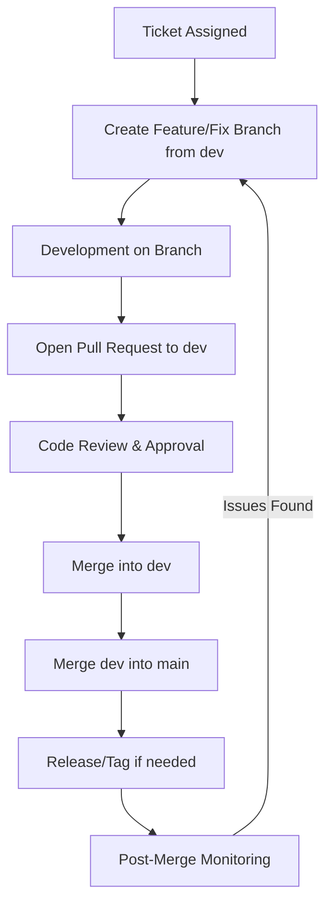

# Halaqti-Contributors Release Cycle

This document outlines the release cycle for the halaqti-contributors repository. It defines the steps code must follow from assignment to merge, ensuring quality, traceability, and smooth collaboration among all contributors.

---

## Branching Strategy

- **main** → Stable, production-ready branch. Only reviewed and approved code goes here.
- **dev** → Active development branch. Integration point for all features and fixes.
- **feature/**, **fix/**, **chore/**, **docs/**, **test/** → Temporary branches created for each ticket or enhancement.

---

## Release Workflow

### 1. Ticket Assignment

- A new feature/fix branch is created from `dev`.
- Naming convention:

  ```
  <ticket_type>/<module>-<ticket_number>_<purpose>
  ```

  - **ticket_type** → `feature`, `fix`, `chore`, `docs`, `test`
  - **module** → Utility or logic area (e.g., `indexeddb`, `quran`, `tests`)
  - **ticket_number** → GitHub issue number
  - **purpose** → Short description

  **Example:**
  ```
  feature/indexeddb-12_add-get-surah-function
  fix/quran-7_handle-empty-surah
  docs/indexeddb-15_document-initializeDB
  ```

---

### 2. Development

- Contributor implements changes on the feature/fix branch.
- Code is regularly committed with meaningful commit messages (see **Commit Message Guidelines**).
- When the task is complete, a Pull Request (PR) is opened against `dev`.

---

### 3. Code Review

- Peer review is required before merging into `dev`.
- Reviewer checks for:
  - Code quality and readability
  - Adherence to standards
  - Abstractness and reusability
  - Proper documentation and typings
- Once approved, the branch is merged into `dev` and deleted.

---

### 4. Main Branch Merge

- When a set of features or fixes is ready and stable, `dev` is merged into `main`.
- Optionally, create a release tag (e.g., `v1.0.0`).

---

### 5. Post-Merge

- Monitor for issues or bugs after merge.
- Hotfixes follow the same process: create a `fix/` branch → merge into `dev` → promote to `main`.

---

## Commit Message Guidelines

To maintain clarity in version control history, use the following convention:

```
<type>(<module>): <short summary>
```

- **Types**:
  - `feat` → New utility or feature
  - `fix` → Bug fix
  - `docs` → Documentation changes
  - `style` → Code style (formatting, etc.)
  - `refactor` → Code changes that don’t fix bugs or add features
  - `test` → Adding or modifying tests
  - `chore` → Maintenance tasks
- **Module**: Utility or area affected (e.g., `indexeddb`, `quran`, `tests`).
- **Summary**: A concise description in imperative tone.

**Examples:**

```
feat(indexeddb): implement getSurah with apiUrl
fix(quran): handle empty surah data
chore(tests): add test coverage for saveQuranData
```

This ensures branch names, commits, and PR titles align for better traceability.

---

## Future Enhancements

- **CI Integration**: Automated builds, linting, and testing on every PR.
- **Release Tags**: Tagging each stable release (e.g., `v1.0.0`).
- **Automated Publishing**: Optionally publish to npm or other registries.

---

## Release Cycle Diagram


